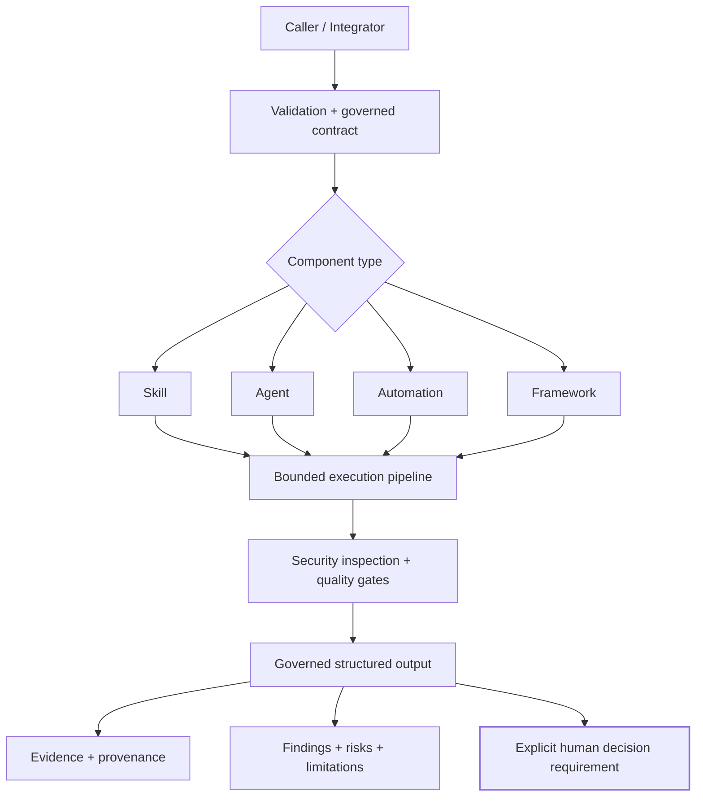

# Bonfim SDK

**A governed Python SDK for building auditable security skills, AI agents and automations with validation, traceability, explicit limitations and human review.**

[](https://github.com/a-bonfim-tech/bonfim-sdk/actions/workflows/ci.yml)
[](https://www.python.org/)
[](LICENSE)
[](CHANGELOG.md)

Bonfim SDK provides reusable infrastructure for developers who need AI-assisted or security-oriented components to produce structured, reviewable and serializable results without silently claiming authority, compliance or certainty.

The SDK owns the governance and execution pipeline. A component author implements the domain-specific behavior inside explicit contracts.

## Why this project exists

AI agents and security automations often fail in predictable ways:

- inputs are accepted without validation;
- evidence provenance is lost;
- confidence is asserted without justification;
- sensitive output is returned accidentally;
- failures expose implementation details;
- automated results are treated as final decisions;
- plugin discovery expands the trust boundary without control;
- release artifacts are distributed without reproducible assurance evidence.

Bonfim SDK addresses these problems through explicit contracts, fail-closed behavior, bounded execution and release evidence.

## What it demonstrates

- Python package and CLI design;
- governed component interfaces;
- immutable top-level input and provenance models;
- deterministic registries and allowlisted plugin discovery;
- bounded agent parallelism;
- retry and rollback-aware automation workflows;
- secret-like output blocking;
- structured evidence, findings, risks and limitations;
- explicit human-review requirements;
- strict typing, linting, SAST, tests and coverage gates;
- full-history secret scanning and CycloneDX SBOM generation;
- wheel and source-distribution validation with clean-install smoke testing;
- protected-branch policy with required CI and CodeQL;
- SHA-256 release integrity and GitHub provenance attestation.

## Engineering assurance at a glance

| Area | Current control |
| --- | --- |
| Python compatibility | Tests on Python 3.11, 3.12, 3.13 and 3.14 |
| Test quality | 58 tests per supported Python version in the retained publication evidence |
| Coverage | 93% branch-aware coverage in the retained publication evidence; release threshold >= 90% |
| Static quality | Ruff + mypy strict |
| SAST | Bandit blocking threshold + CodeQL policy |
| Secret detection | Full-history Gitleaks |
| Supply chain | GitHub Actions pinned to immutable commit SHAs; controlled tool versions |
| SBOM | CycloneDX generation |
| Packaging | wheel + sdist + `twine check` + package-content validation |
| Integrity | SHA-256 release checksum manifest |
| Provenance | GitHub build attestation over release checksums |
| Protected branch | Active repository rulesets require pull requests and CI; force-push/deletion are blocked |
| Human authority | Release tags, GitHub Releases and registry publication remain separate owner decisions |

## Verified engineering evidence

The retained publication candidate passed all mandatory CI jobs on its exact reviewed commit and was subsequently integrated into the public `main` branch.

Verified evidence includes:

- 58 passing tests on Python 3.11, 3.12, 3.13 and 3.14;
- 93% branch-aware coverage across 958 statements and 188 branches;
- Ruff with all checks passing;
- mypy strict with no issues across 27 source files;
- Bandit with no finding at the configured high-severity/high-confidence blocking threshold;
- full-history Gitleaks scanning;
- CycloneDX SBOM generation;
- governance baseline validation;
- wheel and source-distribution build;
- `twine check` validation;
- package-content and metadata validation;
- SHA-256 checksum generation and verification;
- clean virtual-environment installation;
- installed CLI and package-resource smoke tests.

See [Publication Readiness Evidence](docs/publication-readiness-evidence.md) and [Publication Review Checklist](docs/publication-review-checklist.md).

## Architecture at a glance



Conceptually:

```text
validate → execute → inspect → quality gates → structured result → human review
```

See [Architecture](docs/architecture.md), [Security Model](docs/security.md) and [Threat Model](docs/threat-model.md).

## Quick start

### Requirements

- Python 3.11 through 3.14
- No runtime dependencies outside the Python standard library

### Installation for development

```bash
python3 -m venv .venv
source .venv/bin/activate
python -m pip install -e '.[dev]'
bonfim doctor
```

### Create a governed Skill

```bash
bonfim new skill SecurityEvidenceCollector \
  --id SEC-EVD-001 \
  --directory src/my_project
```

### Minimal example

```python
from bonfim import Skill, SkillContext, SkillOutput


class SecurityEvidenceCollector(Skill):
    skill_id = "SEC-EVD-001"
    name = "Security Evidence Collector"
    version = "1.0.0"
    mission = "Package caller-supplied artifacts for human review."
    scope = ("Evidence packaging",)
    out_of_scope = ("Certification", "Remediation")
    activation_conditions = ("Explicit evidence request",)
    required_inputs = ("artifacts",)

    def perform(self, context: SkillContext) -> SkillOutput:
        artifacts = context.inputs["artifacts"]
        return self.output(
            f"Received {len(artifacts)} artifact(s).",
            limitations=("Artifact authenticity was not independently validated.",),
            confidence="Low",
            confidence_justification="Only caller-supplied artifacts were observed.",
            final_verdict="Review Required",
        )


result = SecurityEvidenceCollector().run({"artifacts": ["test.log"]})
print(result.to_dict())
```

The execution pipeline validates the declaration and inputs, creates traceability metadata, executes the component, blocks recognized secret-like output, evaluates quality gates and returns a serializable result.

For a complete reproducible workflow, follow the [End-to-End Quickstart](docs/quickstart-tutorial.md).

## Core APIs

### Skills

Skills implement domain behavior through `perform(context)` while the SDK owns validation, execution, security inspection and output construction.

### Agents

Agents coordinate an explicit allowlist of Skills. Execution can be sequential or use bounded thread parallelism. Aggregated results preserve order and remain subject to human review.

### Automations

Automations run trigger-controlled workflows with bounded retries, monitoring and observable rollback attempts. Rollback receives the exact input mapping used by the completed step. It is compensating behavior, not a guarantee that external effects were reversed.

### Frameworks

Frameworks can be loaded from JSON, validated, registered and resolved through dependency order with cycle detection.

### Registries

Central registries support explicit imports and opt-in package entry-point discovery. Discovery requires a caller-provided allowlist.

## CLI

```bash
bonfim new skill SecurityEvidenceCollector --id SEC-EVD-001 --directory src/my_project
bonfim new agent EvidenceAgent --id AGENT-EVD-001
bonfim new automation EvidenceWorkflow --id AUT-EVD-001
bonfim validate --module my_project.skills
bonfim run SEC-EVD-001 --module my_project.skills --inputs '{"artifacts": []}'
bonfim doctor
bonfim version
```

The CLI refuses to overwrite existing component files.

## Security model

Implemented safeguards include:

- explicit imports and allowlisted entry points;
- declaration and Semantic Versioning validation;
- immutable top-level inputs and provenance mappings;
- bounded Agent worker count;
- bounded Automation retries;
- secret-like output detection;
- withheld unexpected exception details;
- mandatory human-review statements;
- Bandit SAST;
- full-history Gitleaks scanning;
- CodeQL protected-branch policy;
- CycloneDX SBOM generation;
- GitHub Actions pinned to immutable commit SHAs;
- package hashes, clean-install validation and build provenance attestation.

Important boundary: imported Python components execute in-process and are trusted. **Bonfim SDK is not a sandbox.** Do not run untrusted third-party components.

See [Security Model](docs/security.md), [Threat Model](docs/threat-model.md) and [Security Policy](SECURITY.md).

## Release engineering

Source visibility, candidate validation, GitHub Release publication and package-registry publication are deliberately separate decisions.

```mermaid
flowchart LR
    Change[Reviewed change] --> Main[Protected main]
    Main --> Candidate[Manual exact-ref candidate validation]
    Candidate --> Human[Explicit owner release decision]
    Human --> Tag[Annotated signed version tag]
    Tag --> Matrix[Python 3.11-3.14 release tests]
    Matrix --> Assurance[Coverage + Ruff + mypy + Bandit + Gitleaks + BQA/BRE]
    Assurance --> Package[wheel + sdist + SBOM + SHA256SUMS]
    Package --> Attest[Build provenance attestation]
    Attest --> GHRelease[GitHub Release]
    GHRelease -. separate decision .-> Registry[Package registry]
```



The `0.2.1` hardening line strengthens the release workflow so the GitHub Release can carry the verified distributions, SBOM, checksums and governance evidence rather than publishing an evidence-light tag page.

See [Release Policy](RELEASE_POLICY.md) and [Release Process](RELEASING.md).

## Build provenance

Build distributions generated from the public `main` branch receive GitHub artifact attestations. Release distributions are designed to carry an attested SHA-256 checksum set covering the wheel, source distribution, SBOM and release-gate evidence.

Consumers can verify a downloaded artifact with:

```bash
gh attestation verify <artifact> --repo a-bonfim-tech/bonfim-sdk
```

## Quality and verification

```bash
python -m compileall -q src examples tests
PYTHONPATH=src python -m coverage run -m unittest discover -s tests -v
python -m coverage report --fail-under=90
python -m ruff check src tests examples
python -m mypy -p bonfim
python -m bandit -r src -q -lll -iii
```

## Repository map

```text
src/bonfim/          SDK implementation
tests/               contract and behavior tests
examples/            read-only reference components
templates/           component templates
docs/                architecture, security and interface documentation
tools/               quality and release verification
quality/             quality baseline manifest
release/             release baseline manifest
.github/workflows/   CI, candidate and release gates
```

## Public interfaces

- `Executable`
- `Validatable`
- `Traceable`
- `Governable`
- `Versionable`
- `Documentable`

Shared models include `Evidence`, `Finding`, `Risk`, `Limitation`, `Recommendation`, `Decision`, `Observation`, `Requirement`, `Provenance`, `Traceability` and `OutputContract`.

## Limitations

- Pre-alpha software; APIs may change.
- No process or container isolation for component execution.
- No network connector implementation.
- No persistent scheduler, database or durable audit store.
- No signed plugin verification or package-attestation enforcement by consumers.
- Secret-pattern inspection is not a complete DLP control.
- Builds are not hermetic/offline.
- Successful execution does not prove an external effect, compliance, certification or approval.

## Project status

Current source hardening version: `0.2.1`.

The source repository is public and the project remains pre-alpha. Public source availability does not imply production readiness, certification, support commitments or package-registry publication.

`0.2.1` is a release-hardening line. A GitHub Release remains a separate owner decision after the exact merged candidate passes the dedicated release-candidate workflow.

No package has been published to PyPI. GitHub Release publication and package-registry distribution remain separate decisions.

## Next architecture line

After the `0.2.x` release-hardening work, the proposed `0.3.x` line is **Isolated Execution Architecture**: preserve trusted in-process components while introducing a separate bounded runner for less-trusted workloads using explicit capabilities, execution deadlines and resource limits.

That future line is architectural work, not a claim that sandboxing exists today.

## Contributing

See [CONTRIBUTING.md](CONTRIBUTING.md). Security reports must follow [SECURITY.md](SECURITY.md).

## License

Copyright 2026 André Luiz Vieira Bonfim.

Licensed under the [Apache License 2.0](LICENSE). Bonfim Labs is the project and publishing name associated with Bonfim SDK; product names and marks remain subject to the limitation recorded in [NOTICE](NOTICE).
